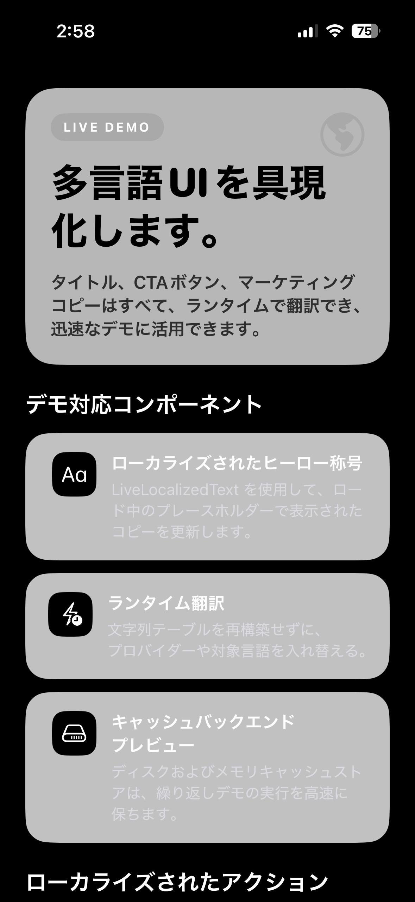
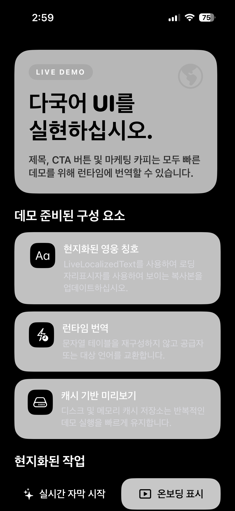
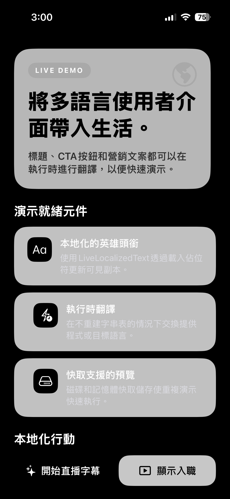

# LiveLocalizationKit

A Swift Package that helps small teams and indie developers add multilingual support to SwiftUI and UIKit apps faster.

It provides a provider-based localization stack with built-in Apple Translation support, UI-ready wrappers, and configurable caching for runtime localization flows and custom translation backends.

<p align="center">
  
  
  
</p>

## Features

- runtime localization for SwiftUI and UIKit apps
- provider-based architecture for custom translation backends
- built-in Apple Translation support
- batch-capable provider support with async request throttling controls
- SwiftUI `LiveLocalizedText` and UIKit `LiveLocalizedLabel`
- loading placeholders, progress callbacks, and completion callbacks for UI wrappers
- in-memory and disk-backed cache stores
- configurable cache policy with namespacing, provider segmentation, and TTL
- pseudo-localization, passthrough, and mock translation providers
- shared localizer configuration and explicit localizer injection

## Swift Package Manager

Add this repository in Xcode:

```text
https://github.com/MikeChen1109/LiveLocalizationKit.git
```

Available products:

- `LiveLocalizationCore`
- `LiveLocalizationUI`
- `LiveLocalizationTranslationSupport`

## Quick Start

Configure Apple Translation-based preview:

```swift
import LiveLocalizationCore
import LiveLocalizationTranslationSupport

await LiveLocalization.configure(
    provider: AppleTranslationProvider(),
    cacheStore: DiskLocalizationCacheStore(),
    cachePolicy: LocalizationCachePolicy(
        namespace: "preview",
        providerIdentifier: "apple-translation"
    )
)
let localized = await "Settings".localize()
```

`LiveLocalization.configure(...)` is async because shared configuration can prewarm injected cache stores such as `DiskLocalizationCacheStore` before your UI starts reading localized content.

For lightweight development flows, `LiveLocalizationCore` also includes providers such as `PseudoLocalizationProvider`, `MockLocalizationProvider`, and `PassthroughLocalizationProvider`.

## Create Your Own Provider

Custom providers implement `LocalizationProvider` and receive a `LocalizationRequest`.

```swift
import LiveLocalizationCore

struct MyTranslationProvider: LocalizationProvider {
    func translate(_ request: LocalizationRequest) async throws -> LocalizationResponse {
        let targetLanguage = request.targetLanguageIdentifier ?? "en"
        let localizedText = "[\(targetLanguage)] \(request.sourceText)"
        return LocalizationResponse(localizedText: localizedText)
    }
}
```

Use the shared package flow:

```swift
await LiveLocalization.configure(
    provider: MyTranslationProvider(),
    cacheStore: MemoryLocalizationCacheStore(),
    cachePolicy: LocalizationCachePolicy(providerIdentifier: "my-provider")
)
let text = await "Settings".localize()
```

Or create an explicit localizer with a custom cache store:

```swift
let localizer = LiveLocalizer(
    provider: MyTranslationProvider(),
    cacheStore: DiskLocalizationCacheStore(),
    cachePolicy: LocalizationCachePolicy(
        namespace: "preview",
        providerIdentifier: "my-provider",
        entryLifetime: 3600
    )
)
let text = await "Checkout".localize(using: localizer)
```

Or pass more request context when you need it:

```swift
let text = await "Checkout".localize(
    sourceLanguageIdentifier: "en",
    targetLanguageIdentifier: "ja",
    context: "paywall.primary_cta"
)
```

Provider guidance:

- Return `request.sourceText` when you want an explicit fallback.
- Use `targetLanguageIdentifier` and `context` if your backend needs routing or domain-specific prompts.
- If your provider can answer immediately, prefer `SyncLocalizationProvider`.

See [`docs/ProviderGuide.md`](docs/ProviderGuide.md) for a fuller guide to custom provider design.

If your backend accepts multiple compatible strings in one request, adopt `BatchLocalizationProvider` so `LiveLocalizer` can coalesce nearby requests and issue a single batch call:

```swift
struct MyBatchProvider: BatchLocalizationProvider {
    func batchGroupIdentifier(for request: LocalizationRequest) -> String {
        request.targetLanguageIdentifier ?? "default"
    }

    func translateBatch(_ requests: [LocalizationRequest]) async throws -> [LocalizationResponse] {
        requests.map { request in
            LocalizationResponse(localizedText: "[batch] \(request.sourceText)")
        }
    }

    func translate(_ request: LocalizationRequest) async throws -> LocalizationResponse {
        let responses = try await translateBatch([request])
        return responses[0]
    }
}
```

## Execution Policy

`LocalizationExecutionPolicy` lets you tune async throughput for shared and explicit localizers:

```swift
let localizer = LiveLocalizer(
    provider: MyBatchProvider(),
    executionPolicy: LocalizationExecutionPolicy(
        maxConcurrentAsyncRequests: 4,
        batchWindow: .milliseconds(30),
        maxBatchSize: 16
    )
)
```

Use this when you want to protect a remote backend from burst traffic or increase batch efficiency for providers that support grouped translation.

## Cache Stores

`LiveLocalizationCore` supports pluggable cache stores.

- `MemoryLocalizationCacheStore` keeps results in memory for the current process.
- `DiskLocalizationCacheStore` persists localized text to disk across launches.
- `LocalizationCachePolicy` supports namespacing, provider-aware segmentation, and TTL-based expiration.
- Shared `LiveLocalization.configure(...)` can prewarm an injected cache store before the shared localizer is published.

```swift
let localizer = LiveLocalizer(
    provider: MyTranslationProvider(),
    cacheStore: DiskLocalizationCacheStore(),
    cachePolicy: LocalizationCachePolicy(
        namespace: "preview",
        providerIdentifier: "my-backend",
        entryLifetime: 3600
    )
)
```

## Observability

`LiveLocalizationCore` includes lightweight runtime event hooks for debugging and instrumentation.

You can observe:

- shared configuration start / finish
- cache warmup start / finish
- cache hit / miss / write / invalidation / clear
- provider translation start / success / failure fallback

```swift
let logger = ClosureLocalizationLogger { event in
    print("Localization event:", event)
}

await LiveLocalization.configure(
    provider: MyTranslationProvider(),
    cacheStore: DiskLocalizationCacheStore(),
    cachePolicy: LocalizationCachePolicy(providerIdentifier: "my-provider"),
    logger: logger
)
```

## UI Layer

`LiveLocalizationUI` adds simple view wrappers on top of the core localizer layer.

SwiftUI:

```swift
import SwiftUI
import LiveLocalizationUI

LiveLocalizedText("Continue")
    .placeholder { phase in
        Text(phase.displayedText)
            .redacted(reason: .placeholder)
    }
    .onProgress { phase in
        print("phase:", phase)
    }
    .onCompletion { completion in
        print("localized:", completion.localizedText)
    }
```

UIKit:

```swift
import UIKit
import LiveLocalizationUI

let label = LiveLocalizedLabel()
label.setLocalizedText(
    "Continue",
    progressHandler: { label, phase in
        print(label, phase)
    },
    completionHandler: { label, completion in
        print(label, completion.localizedText)
    }
)
```

Notes:

- `LiveLocalizedText` now keeps UI customization separate from event callbacks: use `placeholder { ... }` for loading presentation and `onProgress` / `onCompletion` for side effects.
- `LiveLocalizedLabel` starts blank while loading and reports progress and completion through handler-based callbacks.

## Apple Translation Preview

If you want a debug flow that checks whether required language packs are available and guides preparation before showing the UI:

```swift
import SwiftUI
import LiveLocalizationTranslationSupport

TranslationPreparationGate {
    ContentView()
}
```

If you need custom presentation logic, use `TranslationPreparationCoordinator` directly.

Notes:

- package products support `iOS 18` and `macOS 15`
- `AppleTranslationProvider` requires `iOS 26` or `macOS 26`
- available languages depend on the system
- language packs may need to be downloaded on device first

If language pack download appears stuck in-app, managing the pack first in Apple's built-in `Translate` app is often more reliable during testing.

## Demo App

See `LiveLocalizationDemo.xcodeproj` for the bundled demo app. The demo sources live under `LiveLocalizationKit/` and cover both SwiftUI and UIKit preview flows.

## License

MIT
